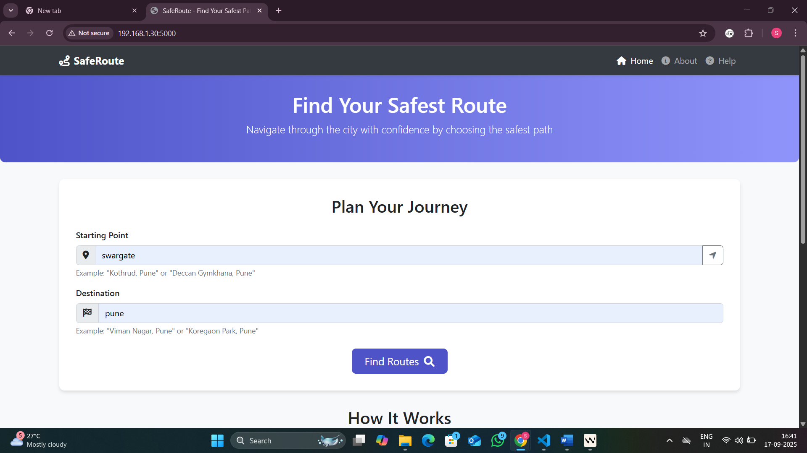
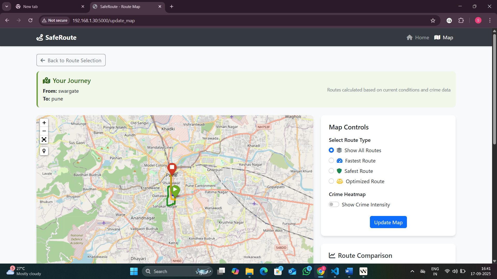
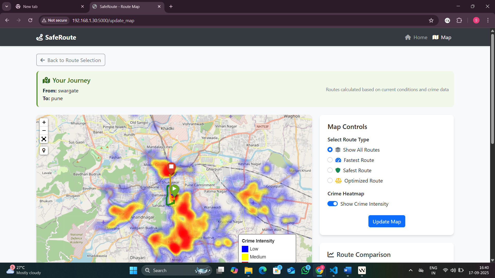

# Safe Route Generation: A Smart Navigation System

A web-based smart navigation system that generates routes between two points in Pune, India, while considering historical crime data to provide not just the fastest, but also the safest and most optimized travel options.

---

## 🚀 Live Demo

Access the live deployed application here:  
👉 [https://safe-route-generation.onrender.com](https://safe-route-generation.onrender.com)

**Note on Performance:**
- **Slow Initial Load:** The service "spins down" after 15 minutes of inactivity and can take up to a minute to restart on the first visit.
- **Potential Failures (502 Error):** The free tier has a strict memory limit. Due to the large size of the geographical and crime data, the application may occasionally exceed this limit and restart, leading to a temporary "502 Bad Gateway" error. If you encounter this, please try refreshing after a minute.

---

## ✨ Features

- **Multiple Route Options:** Calculates three distinct routes between any two locations:
  - **Fastest Route:** The standard, shortest-distance path.
  - **Safest Route:** A path that actively avoids areas with a high historical incidence of crime.
  - **Optimized Route:** A balanced option that considers both distance and safety.
- **Interactive Map:** Displays all three routes on an interactive Folium map for easy comparison.
- **Crime Heatmap:** Overlays a visual heatmap on the map, showing the relative intensity of crime hotspots across the city.
- **Detailed Route Analysis:** Provides key statistics for each route, including distance, an estimated crime risk level, and the types of crimes common along the path.

---

## 🛠️ How It Works

The core challenge of this project is the immense computational cost of calculating crime-adjusted routes in real-time. To solve this and ensure a fast user experience, the application uses a pre-computation strategy.

### 1. Offline Data Processing (The "Factory")
Before deployment, a series of local Python scripts are run to handle the heavy computational work:

- **Graph Generation (`generate_graph.py`):** The road network for Pune is fetched from OpenStreetMap using osmnx and simplified to reduce its memory footprint.
- **Data Pre-computation (`precompute_weighted_graphs.py`):**
  - Loads the base road network and the historical crime dataset.
  - Uses a trained machine learning model (`crime_severity_model.pkl`) to predict the current severity of every known crime location.
  - Creates and saves multiple versions of the road network graph (`safe_graph.pkl`, `optimized_graph.pkl`) where the "length" of roads near high-crime areas is artificially increased.
  - Pre-calculates and saves the data for the heatmap (`heatmap_data.pkl`).
  - Adds a `precomputed_severity` column to the crime data for instant lookups.

### 2. Online Serving (The Live Application)
The deployed Flask application is designed to be lightweight and fast. It does not perform any heavy calculations.

- **Loading Data:** On startup, the server loads all the pre-computed `.pkl` files into memory.
- **User Request:** When a user enters a start and end point:
  - The app uses the pre-weighted graphs to find the safest and optimized routes almost instantly using the A* algorithm.
  - It uses the pre-computed heatmap data to display the crime intensity overlay.
  - It uses the pre-computed severity values in the crime data to quickly calculate and display route statistics.

This architecture ensures that the user gets a response in seconds, rather than the many minutes it would take to perform these calculations on every request.

---

## 💻 Technology Stack

- **Backend:** Flask
- **Geospatial Analysis:** OSMnx, NetworkX, Geopy
- **Machine Learning:** Scikit-learn, Pandas
- **Mapping & Visualization:** Folium
- **Web Server:** Gunicorn
- **Deployment:** Render

---

## 🔧 Local Development Setup

To run this project on your local machine, follow these steps:

1. **Clone the repository:**
   ```sh
   git clone https://github.com/Shailu1964/Safe-Route-Generation.git
   cd Safe-Route-Generation
   ```
2. **Create and activate a virtual environment:**
   ```sh
   # For Windows
   python -m venv venv
   venv\Scripts\activate

   # For macOS/Linux
   python3 -m venv venv
   source venv/bin/activate
   ```
3. **Install the required packages:**
   ```sh
   pip install -r requirements.txt
   ```
4. **Set up environment variables:**
   - Create a file named `.env` in the root directory and add your OpenCage Geocoder API key:
     ```env
     OPENCAGE_API_KEY="your_api_key_here"
     ```
5. **Run the data pre-computation scripts:**
   This step is essential to generate the necessary `.pkl` files.
   ```sh
   python generate_graph.py
   python precompute_weighted_graphs.py
   ```
6. **Run the Flask application:**
   ```sh
   flask run
   ```
   The application will be available at [http://127.0.0.1:5000](http://127.0.0.1:5000).

---

## ☁️ Deployment

This project is configured for continuous deployment on Render using the `render.yaml` file.

1. Push the project to a GitHub repository, ensuring all the essential `.pkl` data files are tracked by Git.
2. Create a new "Web Service" on Render and connect it to your GitHub repository.
3. Add your `OPENCAGE_API_KEY` as an environment variable in the Render dashboard.
4. Render will automatically build and deploy the application based on the instructions in the `render.yaml` and `Procfile`.

---

## 📁 Project Structure

```
├── app.py                      # Main Flask application file
├── route_calculations.py       # Core route calculation and geospatial logic
├── utils.py                    # Utility functions, including crime prediction logic
├── precompute_weighted_graphs.py # (Local) Script to generate weighted graphs and heatmap data
├── generate_graph.py           # (Local) Script to create the simplified base map
├── gunicorn_config.py          # Configuration for the Gunicorn web server
├── requirements.txt            # Python dependencies
├── render.yaml                 # Configuration for Render deployment
├── Procfile                    # Defines the command to start the web server
├── .gitignore                  # Specifies files for Git to ignore
├── /templates/                 # HTML templates for the web interface
├── /static/                    # Static assets (CSS, images)
├── *.pkl                       # Pre-computed data files essential for the live app
├── *.csv                       # Crime datasets
├── process.py                  # Data preprocessing script
├── train.py                    # Model training script
├── cache/                      # Local cache files
└── README.md                   # Project documentation
```

---

## 🖥️ Usage

1. Enter your source and destination in the web interface.
2. The app will display the fastest, safest, and optimized routes, highlighting crime-prone areas on the map.
3. View detailed crime statistics and analysis for your selected route.

---

## 🖼️ Screenshots

> _screenshots for better visualization_







---

## ⚙️ API/Configuration Details

- **Model & Data Files:**
  - `crime_severity_model.pkl`: Machine learning model for crime prediction.
  - `pune_graph.pkl`, `safe_graph.pkl`, `optimized_graph.pkl`: Graph objects for route calculations.
  - `heatmap_data.pkl`: Precomputed data for the crime heatmap.
  - CSV files: Contain raw and processed crime data.
- **Configuration:**
  - Environment variables (API keys, Flask settings) can be set in `.env`.

---

## 🛠️ Troubleshooting

- If you encounter missing package errors, ensure your virtual environment is activated and all dependencies are installed.
- For issues with map rendering, check that the `static/map/` directory is writable.
- Logs are saved in `app.log` for debugging.
- If you see a 502 error on Render, wait a minute and refresh the page.

---

## 🤝 Contributing

1. Fork this repository.
2. Create a new branch: `git checkout -b feature/your-feature`
3. Make your changes and commit: `git commit -am 'Add new feature'`
4. Push to your branch: `git push origin feature/your-feature`
5. Open a Pull Request.

---

## 📬 Contact / Author

- **Author:** Shailu1964
- **GitHub:** [Shailu1964](https://github.com/Shailu1964)
- **Email:** yerawad.shailesh@gmail.com

---

If you have questions or suggestions, feel free to open an issue or contact the author.
